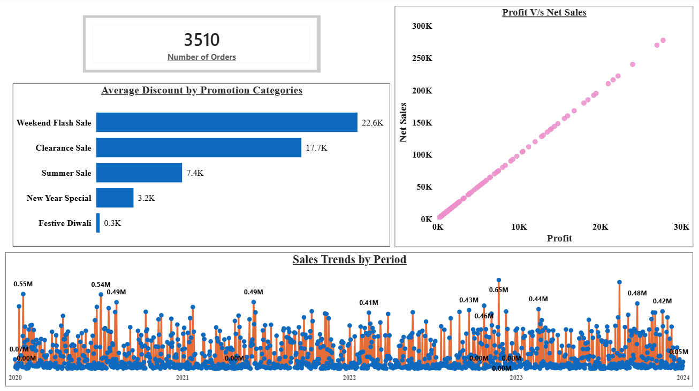
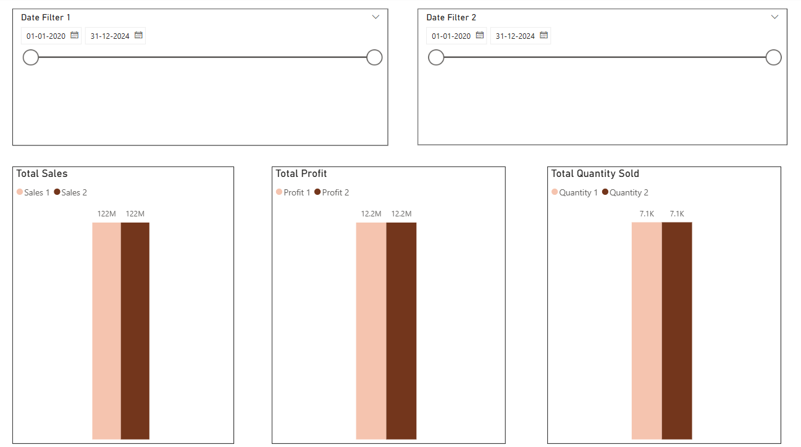
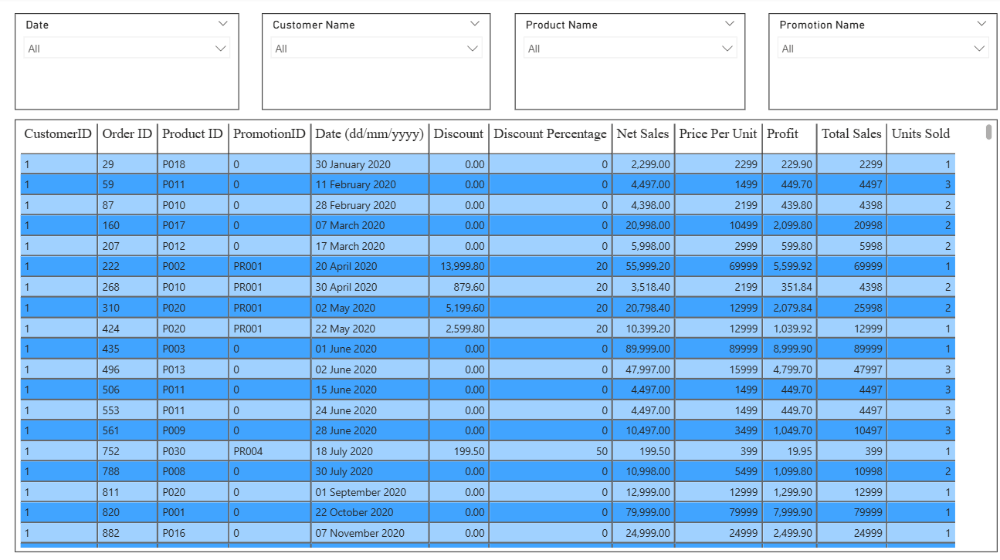

# 📊 ElectroHub Sales Performance Dashboard (Power BI)

## 🔹 Project Overview
This project presents an interactive Power BI dashboard built to analyze sales performance for ElectroHub.  
The dashboard provides insights into product performance, profitability, discount impact, time-based trends, and order-level details using DAX and dynamic filtering.

---

## 🎯 Business Objective
Design a data-driven dashboard to support business decision-making by answering key analytical questions related to sales, profit, promotions, and customer transactions.

---

## 📋 Business Requirements

The dashboard was developed to answer the following questions:

1. What are the Top and Bottom 5 products by Sales, Profit, and Quantity Sold?  
2. How do sales trends vary over time (daily, monthly, quarterly, annually)?  
3. What is the relationship between Sales and Profit?  
4. How does performance compare between any two user-selected periods?  
5. What is the average discount offered in each promotion category?  
6. What is the total number of orders?  
7. Can users view order-level details filtered by Product, Date, Customer, and Promotion Category?

---

## 🧰 Tools & Technologies Used

- **Power BI Desktop**
- **DAX (Data Analysis Expressions)**
- **Data Modeling (Star Schema)**
- **Time Intelligence Functions**
- Interactive slicers and dynamic comparison filters

---

## 📊 Key KPIs

- Total Sales  
- Total Profit  
- Total Quantity Sold  
- Total Orders  
- Profit Margin %

---

## 📈 Key Insights

- 📌 Apple iPhone 14 is the top-performing product in terms of Sales and Profit.
- 📌 Weekend Flash Sales offer the highest average discount.
- 📌 Sales and Profit show a strong positive correlation.
- 📌 Period comparison feature enables clear identification of growth trends.
- 📌 Discount-heavy promotions do not always result in higher profitability.

---

## 📸 Dashboard Preview

### 🔹 Overview Page


### 🔹 Top & Bottom 5 Analysis


### 🔹 Sales / Profit / Quantity Comparison


### 🔹 Order-Level Table View



## 🧮 Sample DAX Measures

```DAX
Total Sales = SUM(Sales[Net Sales])

Total Profit = SUM(Sales[Profit])

Profit Margin % =
DIVIDE([Total Profit], [Total Sales])

Sales Growth % =
DIVIDE(
    [Current Period Sales] - [Previous Period Sales],
    [Previous Period Sales]
)
